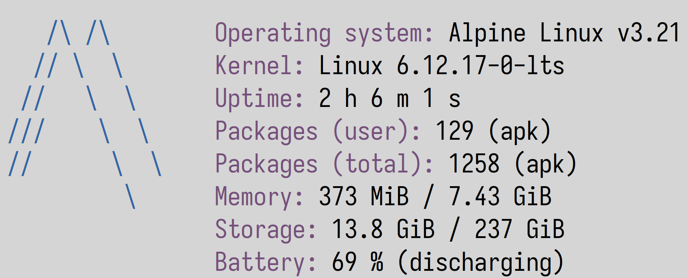

# Sfetch



Sfetch is a command-line system information utility, similar to Fastfetch and
Neofetch. It is intended to be an alternative to Fastfetch with better
performance. Currently, it runs about four times faster than Fastfetch on my
machine. However, I still haven’t implemented command-line arguments and a
configuration file yet. Expect the performance to be closer when they are added.

# Installation

## Dependencies

- Zig 0.14.0 or greater
- SQLite

## Building

In a terminal, run the following commands:

```sh
git clone https://github.com/amarz45/sfetch
cd sfetch/source
```

Then:

```sh
zig build --release=safe --prefix ~/.local
```

Alternatively, if you want to install for all users:

```sh
zig build --release=safe --prefix /usr/local
```

# Contributing

Currently, the only operating systems with full support are  Alpine Linux,
Debian Linux, Ubuntu Linux, Fedora Linux, and Gentoo Linux. I plan to support
all operating systems that Fastfetch supports. If you want your operating
system to be supported, you should do the following:

1. Open an issue in the issue tracker;
1. Add your operating system name in the title;
1. In the body text, paste the contents of the file `/etc/os-release`;
1. Be prepared to provide me with any additional files on my request.

# Credit

All of the icons in this repository are taken directly from
.
Special thanks to  for testing.

# Copying

This software is under the MIT license. See the `Copying.txt` file for more
details. The icons have been taken from Fastfetch, which is also under the same
license. You can see them in `icons/fastfetch` in the root directory of the
source tree.
